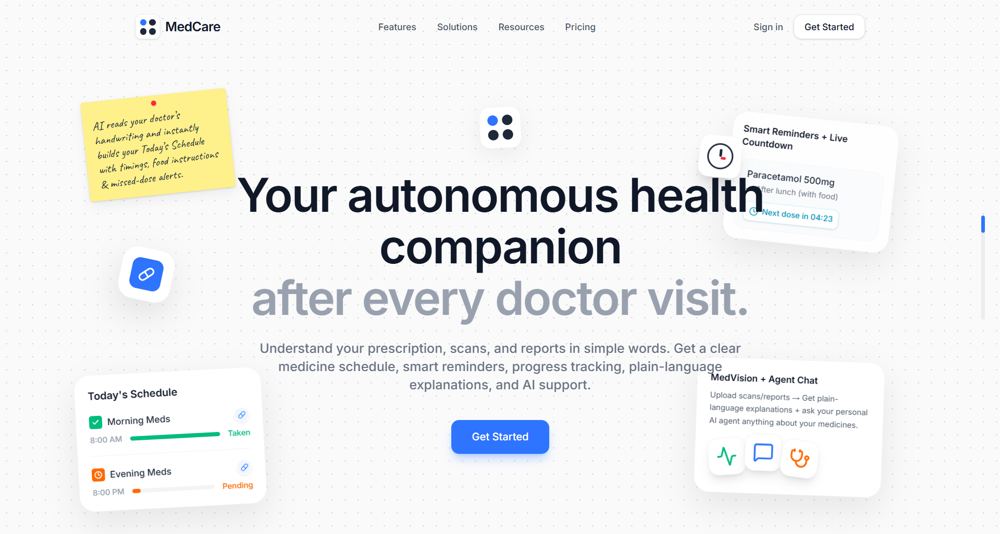
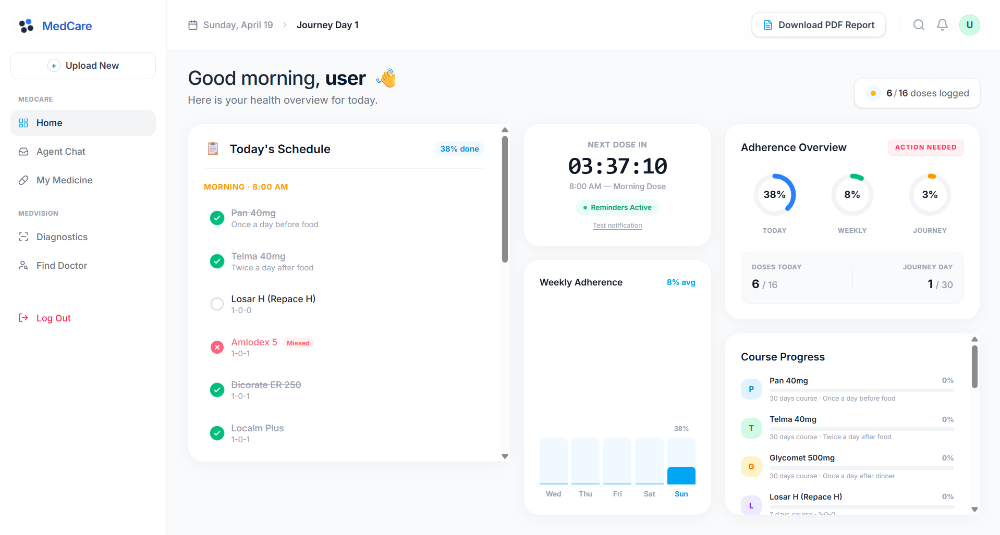
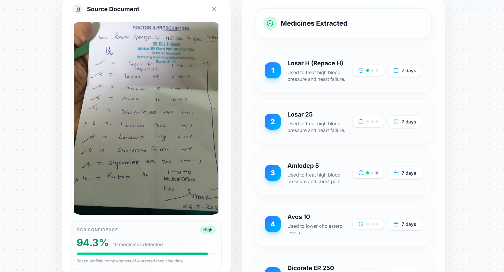
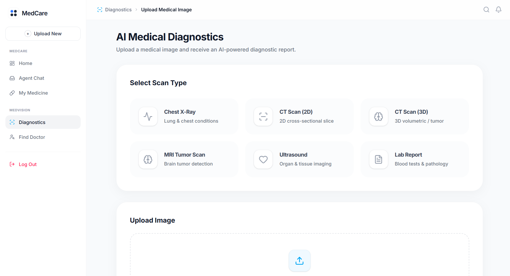
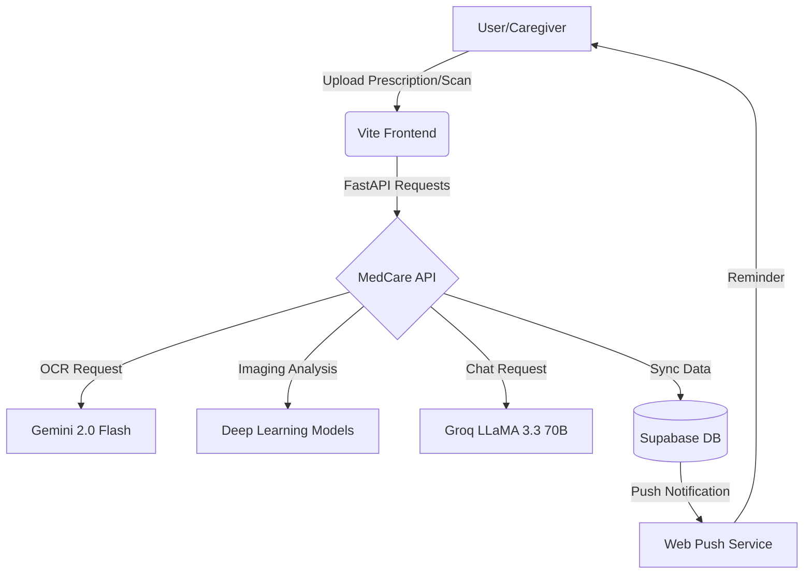

# 💊 MedCare — Your Autonomous Health Companion

[](https://med-care-tau.vercel.app/)


**Doctor’s visit over. Now what?**  
MedCare transforms confusing prescriptions, complex medical scans, and dense reports into simple, actionable guidance. Designed for families and caregivers, it bridges the gap between the clinic and daily recovery with AI-driven adherence, smart reminders, and plain-language medical insights.

---

### 🎯 The Problem
In the rush of a clinical visit, patients often leave with:
- **Illegible Handouts**: Messy handwritten prescriptions that are hard to decipher.
- **Complex Scans**: MRI/CT/X-ray reports filled with intimidating medical jargon.
- **Adherence Gaps**: Confusion over dosage timings, food precautions, and missed doses.
- **High Costs**: Lack of visibility into cheaper, high-quality medicine alternatives.

MedCare solves the **"post-visit black hole"** by becoming your personal autonomous health companion.

---

### ✨ Key Features

#### 📄 Smart Prescription OCR
- **Gemini 2.0 Flash Power**: Upload any handwritten prescription. Our pipeline extracts medicine names, dosages, frequencies, and durations with high precision.
- **Price Transparency**: Instant price comparison across **1mg, PharmEasy, Apollo, and Truemeds** to find the most affordable options.

#### 🧠 MedVision: Diagnostic Intelligence
- **Multi-Modal Analysis**: Specialized Deep Learning models (DenseNet121, ResNet50) analyze **X-rays, MRI, CT, and Ultrasound** scans.
- **Plain-Language Reports**: Converts complex findings into concise, 200-300 word summaries that anyone can understand.
- **Lab Report Insight**: AI-driven analysis of blood tests and pathology reports.

#### ⏰ Intelligent Adherence Agent
- **30-Day Journey**: One-click setup for your entire medication course.
- **Smart Reminders**: Web Push notifications ensuring you never miss a dose.
- **Visual Progress**: Dynamic **Recharts** dashboard showing ✅ Taken vs ❌ Missed adherence rates.

#### 💬 Context-Aware AI Companion
- **LLaMA 3.3 70B Powered**: An AI agent that remembers your medication history, allergies, and conditions.
- **Actionable Advice**: Ask "How does this medicine affect my diet?" or "What are the side effects?" and get personalized, compassionate answers.

#### 📍 Healthcare Connectivity
- **Doctor Finder**: Integrated **Leaflet.js + Overpass API** to locate specialized doctors and hospitals near your live location.

---

### 📸 Visual Tour

<p align="center">
  
  
</p>
<p align="center">
  
  
</p>

---

### 🛠️ Tech Stack

| Layer | Technology |
| :--- | :--- |
| **Frontend** | React 19, Vite, Tailwind CSS 4, Framer Motion |
| **Data Viz** | Recharts, Lucide Icons |
| **Backend** | Python 3.10+, FastAPI, Uvicorn |
| **AI Models** | Google Gemini 2.0 Flash, Groq (LLaMA 3.3 70B), Llama 4 Scout |
| **Deep Learning** | PyTorch, Monai, TensorFlow, Keras |
| **Database/Auth** | Supabase (PostgreSQL + Row Level Security) |
| **Maps** | Leaflet.js, Overpass API |
| **Notifications** | Service Workers, Web Push API |

---

### 📊 Architecture Overview



---

### 🚀 Quick Start

#### 1. Clone the Repository
```bash
git clone https://github.com/Keshav-Swaraj/medCare.git
cd medCare
```

#### 2. Backend Setup
```bash
cd backend
python -m venv venv
source venv/bin/activate  # On Windows: venv\Scripts\activate
pip install -r requirements.txt
cp .env.example .env
# Add your GEMINI_API_KEY, GROQ_API_KEY
uvicorn main:app --reload --port 8000
```

#### 3. Frontend Setup
```bash
# In a new terminal
cd ..
npm install
cp .env.example .env
# Add your VITE_SUPABASE_URL and VITE_SUPABASE_ANON_KEY
npm run dev
```

---

### ⚠️ Important Disclaimer
**Not a medical device.** MedCare is a prototype developed for educational and demonstration purposes.  
- All AI outputs (OCR, Imaging, Chat) are preliminary and **not** a substitute for professional medical advice.
- Always consult a certified healthcare professional before making any medical decisions.
- Do not rely solely on this tool for emergency or critical health management.

---

### 🙌 Why We Built This
In many households, especially in India, the transition from the doctor's clinic to home recovery is often chaotic. Caregivers are overwhelmed, and elderly patients struggle with complex schedules. MedCare was built to provide a **bridge of clarity**—leveraging state-of-the-art AI to ensure that "Post-Visit" doesn't mean "Confusion".

### 👥 Team
- **Keshav Swaraj** — Full Stack & AI Implementation
- *[Add other team members here]*

---

### 📄 License
This project is licensed under the MIT License - see the [LICENSE](LICENSE) file for details.
